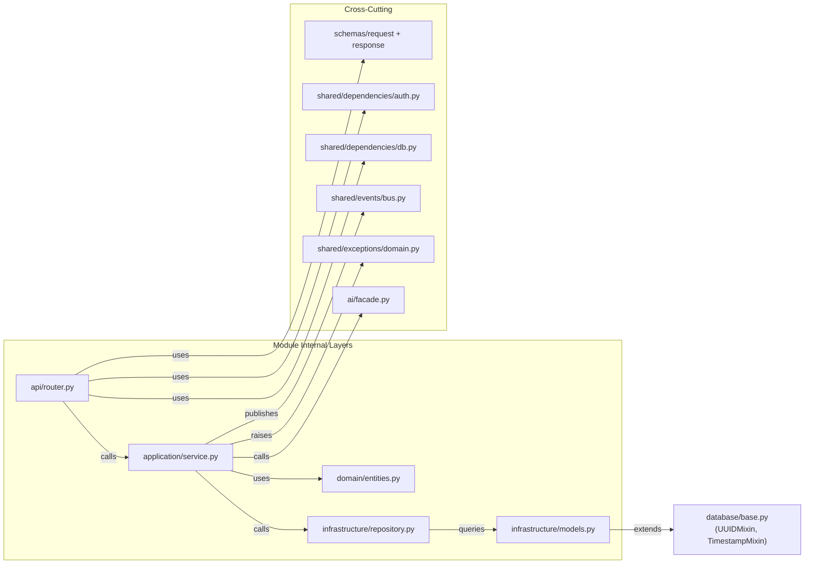
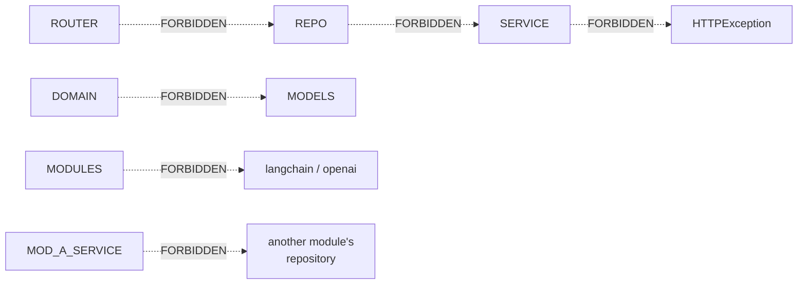
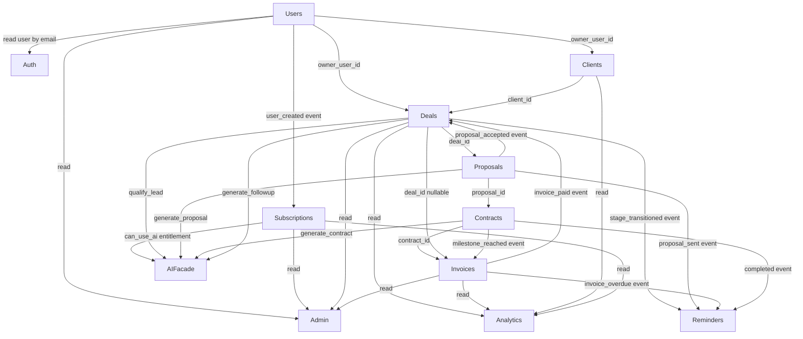

# Dependency Map

Full dependency diagram showing allowed and forbidden directions between all layers and modules.

---

## Layer Dependency Direction

---

## Forbidden Dependencies

---

## Module Inter-Dependency Map

---

## Dependency Rules Summary

| From | To | Type | Allowed? |
|------|----|------|----------|
| `api/router` | `application/service` | Direct call | ✅ |
| `api/router` | `infrastructure/repository` | Direct call | ❌ |
| `application/service` | `domain/entities` | Direct | ✅ |
| `application/service` | `infrastructure/repository` | DI injected | ✅ |
| `application/service` | `ai/facade` | DI injected | ✅ |
| `application/service` | `shared/events/bus` | Module-level singleton | ✅ |
| `application/service` | `HTTPException` | Import | ❌ |
| `infrastructure/repository` | `application/service` | Any | ❌ |
| `domain/entities` | SQLAlchemy | Import | ❌ |
| `src/modules/*` | `langchain` / `openai` | Import | ❌ |
| Module A service | Module B repository | Direct | ❌ |
| Module A service | Module B service | Direct call (read) | ⚠️ Auth→Users only |
| Module A service | Module B via event | EventBus | ✅ |
| `analytics` | Any domain table | Read-only query | ✅ |
| `admin` | Any domain service | Read-only call | ✅ |
