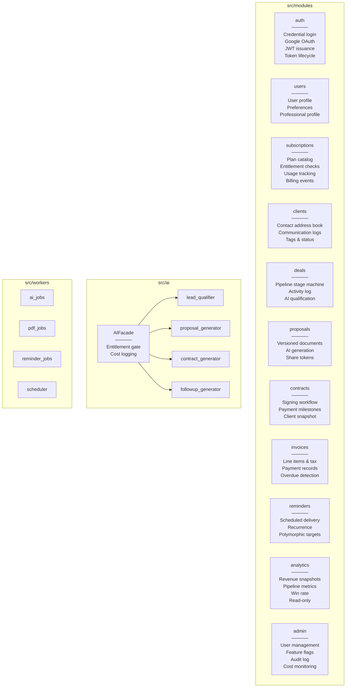

# Module Map

Visual map of all modules, their internal structure, and key responsibilities.

---

## Module Inventory



---

## Module Internal Structure

Every module follows this exact layout:

```
modules/<name>/
├── api/
│   └── router.py          HTTP boundary only. One service call per endpoint.
│                          Uses: CurrentUserId, DBSession, request schemas
│
├── application/
│   └── service.py         All business rules. Raises domain exceptions.
│                          Uses: repository, AIFacade, EventBus
│
├── domain/
│   └── entities.py        Pure Python dataclasses. Zero I/O.
│                          Encodes invariants as methods.
│
├── infrastructure/
│   ├── models.py          SQLAlchemy ORM. Data containers only.
│   └── repository.py      Queries only. Always filters owner_user_id + deleted_at.
│
└── schemas/
    ├── request.py         Pydantic v2. Shape validation only.
    └── response.py        Pydantic v2. model_config from_attributes=True.
```

---

## Shared Infrastructure

```
src/shared/
├── dependencies/
│   ├── auth.py            CurrentUser, CurrentUserId, AdminUser, TokenClaims
│   └── db.py              DBSession annotated type
├── events/
│   └── bus.py             EventBus — in-process pub/sub
├── exceptions/
│   ├── domain.py          DomainError hierarchy
│   └── http.py            FastAPI exception handlers
├── pagination/
│   └── models.py          PaginationParams, Page[T]
└── logging/
    └── config.py          structlog — JSON in prod, pretty in dev

src/infrastructure/
├── database/
│   ├── base.py            Base, UUIDMixin, TimestampMixin, SoftDeleteMixin
│   ├── models.py          All SQLAlchemy ORM models
│   └── session.py         Async engine, get_db_session()
├── redis/
│   └── client.py          Connection pool, get_redis()
└── celery/
    └── app.py             Celery app + beat schedule
```

---

## Module Dependency Summary

| Module | Reads From | Emits Events To |
|--------|-----------|-----------------|
| Auth | Users (by email), Subscriptions (tier in JWT) | — |
| Users | — (leaf domain) | subscriptions, all (user_created) |
| Subscriptions | Users | auth (plan_changed) |
| Clients | Users | deals, reminders |
| Deals | Clients, Users | proposals, reminders, analytics |
| Proposals | Deals, Users | contracts, deals (proposal_accepted) |
| Contracts | Proposals, Deals, Clients | invoices (milestone_reached) |
| Invoices | Contracts, Deals, Clients | reminders, analytics, deals |
| Reminders | All domains (as targets), Users | — |
| Analytics | Deals, Invoices, Clients, Subscriptions | — |
| Admin | All domains (read-only) | — |
