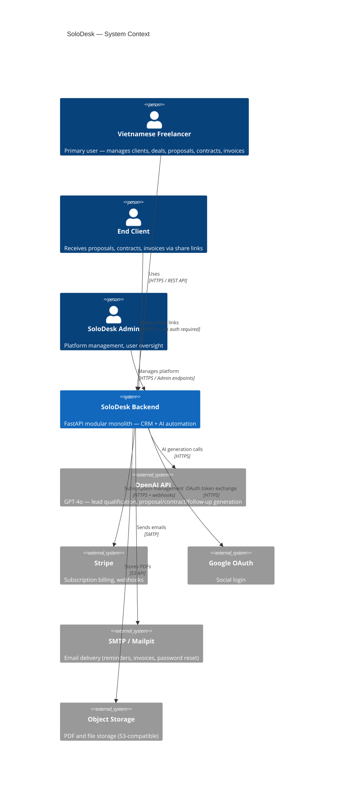
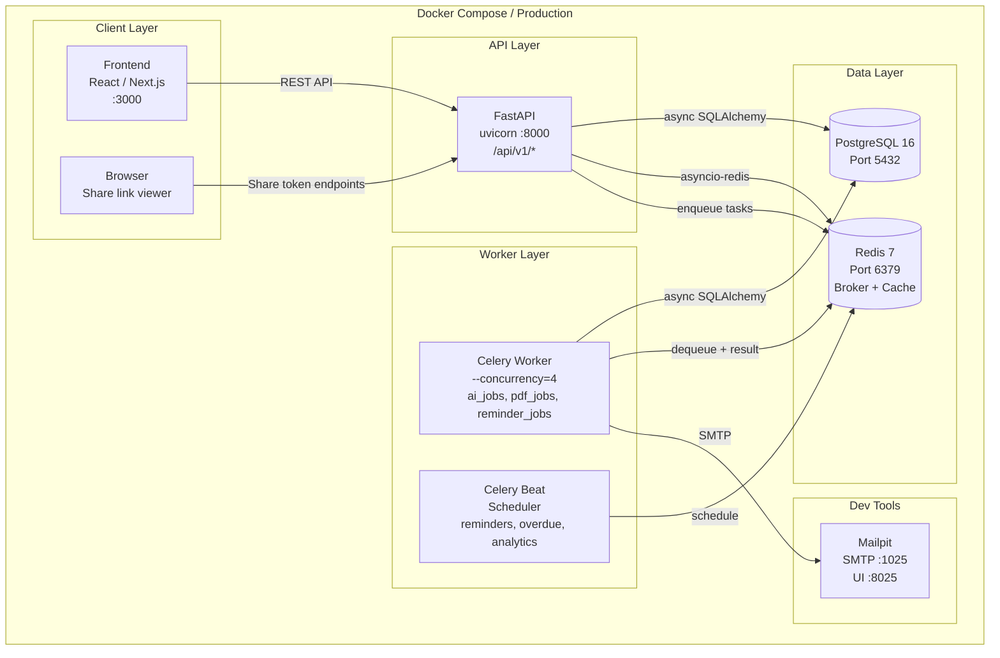
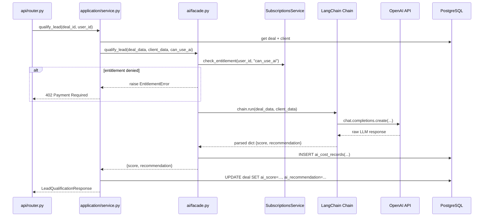
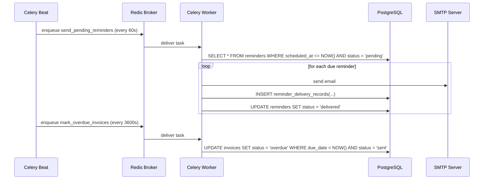

# System Context

High-level view of SoloDesk and how its components interact with each other and with external systems.

---

## System Context Diagram

---

## Container Diagram

---

## AI Interaction Flow

---

## Worker Interaction Flow

---

## Integration Boundaries

| External System | Direction | Adapter Location | Protocol |
|----------------|-----------|-----------------|---------|
| OpenAI | Outbound | `src/integrations/openai_client/` | HTTPS REST |
| Stripe | Inbound (webhooks) + Outbound | `src/integrations/stripe/` | HTTPS REST + webhook |
| Google OAuth | Outbound | `src/integrations/google_oauth/` | HTTPS OAuth 2.0 |
| SMTP | Outbound | `src/infrastructure/email/` | SMTP |
| Object Storage | Outbound | `src/infrastructure/storage/` | S3 API |
| Redis | Internal | `src/infrastructure/redis/client.py` | Redis protocol |
| PostgreSQL | Internal | `src/infrastructure/database/session.py` | asyncpg |

All external I/O goes through adapters in `src/integrations/` or `src/infrastructure/`. Business modules never import SDK clients directly.
